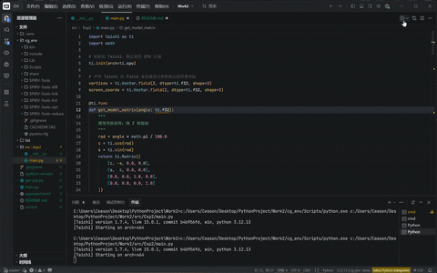

# 3D 空间坐标变换实验

## 实验目标

通过本次实验，你将能够：

- 深入理解 3D 空间中的坐标变换流程（模型-视图-投影/MVP(Model-View-Projection)变换）
- 独立推导并用代码实现模型变换（Model）、视图变换（View）和投影变换（Projection）矩阵
- 掌握面向数据编程框架 Taichi 的基本语法与矩阵操作

## 实验背景

在提供的代码框架中，我们定义了一个三维空间中的三角形。该三角形的初始顶点坐标为：

- $v_0$: (2.0, 0.0, -2.0)
- $v_1$: (0.0, 2.0, -2.0)
- $v_2$: (-2.0, 0.0, -2.0)

你需要将这三个三维空间中的点，通过 MVP 矩阵变换为二维屏幕坐标，并在 Taichi 的 GUI 窗口中绘制出对应的线框三角形。

## 实验要求

你需要补全代码框架中的三个核心函数，返回对应的 $4 \times 4$ 齐次坐标变换矩阵：

### 1. get_model_matrix(angle)

**功能**：接收一个旋转角度（角度制），返回绕 Z 轴旋转该角度的模型变换矩阵。

**实现要点**：
- 将角度转换为弧度：$rad = angle \times \frac{\pi}{180}$
- 构建绕 Z 轴旋转的旋转矩阵

### 2. get_view_matrix(eye_pos)

**功能**：接收相机位置（三维向量），返回视图变换矩阵。你需要将相机平移至世界坐标系的原点。

**实现要点**：
- 计算相机的目标点（通常为原点）
- 计算相机的上方向（通常为 Y 轴）
- 构建视图变换矩阵

### 3. get_projection_matrix(eye_fov, aspect_ratio, zNear, zFar)

**功能**：接收视场角（Y 轴方向，角度制）、屏幕长宽比、近截面距离和远截面距离，返回透视投影矩阵。

**实现要点**：
- 先将透视平截头体挤压为正交长方体（透视到正交矩阵 $M_{persp \to ortho}$）
- 再进行正交投影（$M_{ortho}$）

## 实验提示

### 1. 角度与弧度转换

Python 中的三角函数（如 `ti.sin`, `ti.tan`）使用弧度制。请务必先将传入的 `angle` 和 `eye_fov` 乘以 $\frac{\pi}{180}$ 转换为弧度。

```python
rad = angle * ti.pi / 180
```

### 2. 透视投影的边界计算

在构建正交投影矩阵时，你需要计算视锥体的上 (t)、下 (b)、左 (l)、右 (r) 边界。利用视场角（$fov$）和近截面绝对距离（$|n|$），可以推导：

$$t = \tan(\frac{fov}{2}) \cdot |n|$$
$$b = -t$$
$$r = aspect\_ratio \cdot t$$
$$l = -r$$

### 3. 注意 Z 轴的符号

按照常规的右手坐标系习惯，相机看向 -Z 方向，因此传入的 `zNear` 和 `zFar` 虽然是正值距离（例如 0.1 和 50），但在实际坐标中，近截面 $n = -zNear$，远截面 $f = -zFar$。

### 4. 矩阵乘法顺序

在对顶点 $\mathbf{v}$ 应用变换时，由于我们使用的是列向量，矩阵乘法应当遵循右乘规则（即从右向左执行）：

$$MVP = M_{proj} @ M_{view} @ M_{model}$$

### 5. 透视除法

经过 MVP 矩阵变换后，顶点会变成齐次坐标 $(x, y, z, w)$。在映射到屏幕之前，必须将 $x, y, z$ 分别除以 $w$，使其归一化到 $[-1, 1]$ 的标准设备坐标系 (NDC) 中。

## 参考效果

程序成功运行后，会弹出一个 700x700 的 GUI 窗口，显示一个彩色的线框三角形。按下键盘上的 **A** 键或 **D** 键，三角形会绕着 Z 轴进行顺时针或逆时针旋转。按下 **Esc** 键退出程序。




## 环境要求

- Python 3.12+
- Taichi 1.7.4+
- NumPy

## 安装依赖

### 使用虚拟环境（推荐）

```bash
# 创建虚拟环境
python -m venv cg_env

# 激活虚拟环境
# Windows:
cg_env\Scripts\activate
# Linux/Mac:
source cg_env/bin/activate

# 安装依赖
pip install taichi numpy
```

### 使用 uv（推荐）

```bash
# 安装项目依赖
uv add taichi numpy
```

## 运行项目

```bash
# 使用虚拟环境
cg_env\Scripts\python.exe src\Exp2\main.py

# 或者使用 uv
uv run src\Exp2\main.py
```

## 项目结构

```
Work2/
├── src/
│   └── Exp2/
│       ├── __init__.py
│       └── main.py          # 主程序文件
├── cg_env/                   # 虚拟环境目录
├── pyproject.toml           # 项目配置文件
├── uv.lock                  # 依赖锁定文件
└── README.md                # 项目说明文档
```

## 核心函数说明

### get_model_matrix(angle)

```python
def get_model_matrix(angle):
    """
    构建模型变换矩阵
    
    参数:
        angle: 旋转角度（角度制）
    
    返回:
        4x4 模型变换矩阵
    """
    # TODO: 实现绕 Z 轴旋转的模型变换矩阵
    pass
```

### get_view_matrix(eye_pos)

```python
def get_view_matrix(eye_pos):
    """
    构建视图变换矩阵
    
    参数:
        eye_pos: 相机位置 (x, y, z)
    
    返回:
        4x4 视图变换矩阵
    """
    # TODO: 实现视图变换矩阵
    pass
```

### get_projection_matrix(eye_fov, aspect_ratio, zNear, zFar)

```python
def get_projection_matrix(eye_fov, aspect_ratio, zNear, zFar):
    """
    构建透视投影矩阵
    
    参数:
        eye_fov: 视场角（Y 轴方向，角度制）
        aspect_ratio: 屏幕长宽比
        zNear: 近截面距离（正值）
        zFar: 远截面距离（正值）
    
    返回:
        4x4 透视投影矩阵
    """
    # TODO: 实现透视投影矩阵
    pass
```

## 操作说明

- **A 键**：三角形绕 Z 轴逆时针旋转
- **D 键**：三角形绕 Z 轴顺时针旋转
- **Esc 键**：退出程序

## 许可证

本项目仅用于教学目的。